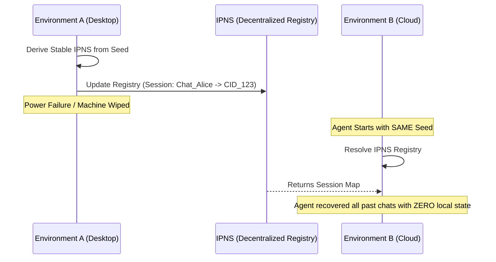

# 🤖 AgentDB: The Decentralized Memory Protocol for AI Agents

**AgentDB** is a high-performance, decentralized memory infrastructure layer that provides AI agents with permanent, sovereign, and collaborative "brains." Built on **Storacha (IPFS/Filecoin)**, **UCAN**, and **X25519**, it transforms ephemeral agent sessions into a global, device-agnostic knowledge graph. 

---

## � Version 1.5.0 Now Live: Full Agentic Sovereignty

We have significantly expanded the AgentDB ecosystem with a full suite of user-facing and developer-centric tools:

- **💬 Decentralized Chat Application**: A native Next.js interface for interacting with self-sovereign agents. Every conversation is uniquely pinned to IPFS, encrypted using agent keys, and indexed via IPNS.
- **📂 Session Registry**: Agents now maintain a decentralized "Memory Map" in their IPNS identity, allowing them to hot-swap between devices while retaining full session history.
- **📚 Comprehensive SDK Reference**: A futuristic documentation hub covering all 39 SDK methods—from basic storage to advanced FHE on-chain vaults.
- **🔒 Zero-Trust Delegation**: Integrated UCAN sharing directly into the UI, enabling one-click context handoffs between agents entirely through the decentralized web.

---
## Readme

[](https://www.canva.com/design/DAHDteT00LE/soWZHvWtuzqISpBeoYg1HA/view?utm_content=DAHDteT00LE&utm_campaign=designshare&utm_medium=embeds&utm_source=link)

### 🛠️ Tech Stack Used

**Blockchain & Decentralized Infrastructure:**


**Cryptography:**


**AI & Agent Frameworks:**


**Development:**


**Testing & Quality:**


### 🏆 Eligible Hackathon Challenges

**AgentDB integrates with these sponsor challenges:**

[](https://devspot.xyz/challenges/ai-robotics)
[](https://devspot.xyz/challenges/storacha)
[](https://devspot.xyz/challenges/filecoin)
[](https://devspot.xyz/challenges/infrastructure-digital-rights)
[](https://devspot.xyz/challenges/lit-protocol)
[](https://devspot.xyz/challenges/zama-confidential-onchain-finance)
[](https://devspot.xyz/challenges/agent-only)
[](https://devspot.xyz/challenges/agents-with-receipts)
[](https://devspot.xyz/challenges/hypercerts)

---

## 🌎 The Vision: Solving the "AI Lobotomy"

Today, AI agents suffer from a fundamental flaw: **amnesia**. Every time a process restarts, a server crashes, or a container scales down, the agent is "lobotomized." Their memory is either trapped in volatile local RAM or locked inside centralized SaaS databases that other agents cannot access. 

**AgentDB changes the fundamental architecture of AI:**

1. **From Local Silos to a Global Graph**: Agents no longer store "thoughts" on a single hard drive. They serialize their context and pin it to the decentralized web (Storacha), making their memory accessible from anywhere on Earth.
2. **From Isolation to Cryptographic Collaboration**: AI models are moving towards multi-agent swarms. Using **UCAN delegations**, Agent B can cryptographically "hand off" its context to Agent A without exposing private keys or relying on centralized middleware.
3. **From Centralized to Sovereign**: You—and your agents—own the memory. There is no API gatekeeper. It is raw, encrypted data pinned to the permanent web, verifiable on-chain.

---

## 🏗️ Technical Architecture & Under-the-Hood

AgentDB operates as a fully peer-to-peer memory layer comprising three core modules. These modules ensure that data is not only stored permanently but retrieved at speeds competitive with Web2 databases.

### 🧩 1. Identity & Authorization Layer (`ucan.ts`)
We standardize agent identification using **Ed25519 DIDs** (Decentralized Identifiers). An agent *is* its private key.
- **Sovereign Agents**: Every agent generates a DID upon initialization (`UcanService.createIdentity()`).
- **Capability Delegation**: When Agent B finishes researching a topic, it issues a cryptographically signed "ticket" (UCAN) to Agent A (`UcanService.delegate()`). This ticket encodes the specific IPFS CID and the `agent/read` capability.
- **Zero-Trust Verification**: Access isn't granted by checking a database; the proof is baked into the math of the UCAN token itself (`UcanService.verifyDelegation()`).

### 🧩 2. Storage & Retrieval Layer (`storacha.ts`)
Powered by **Storacha** (the hot storage layer for Filecoin), we treat IPFS as a high-speed agent backend.
- **Gateway Racing Engine**: The biggest critique of IPFS is latency. AgentDB implements a proprietary retrieval strategy that queries 4+ IPFS gateways (Cloudflare, Pinata, IPFS.io, Storacha) simultaneously. The first one to return the data wins, consistently delivering **sub-second response times** (~500ms).
- **Stable IPNS Mapping**: To solve the problem of moving agents across devices, AgentDB derives a stable mutable pointer directly from an agent's seed (`StorachaService.deriveIpnsName()`). This creates a permanent, deterministic "Home Base" (Session Registry) for the agent's memory map, regardless of the physical hardware it runs on.

### 🧩 3. Security Layer (`encryption.ts`)
For sensitive data, we implement hardware-grade protection using **X25519 (Curve25519)**.
- **ECIES Implementation**: AgentDB combines Diffie-Hellman key exchange with **AES-256-GCM**. When Agent B wants to write a private thought, it encrypts the data so it is mathematically unreadable by anyone but the owner and authorized delegates (`EncryptionService.encrypt()`).

---

## 🧠 Comprehensive Ecosystem Integrations

AgentDB acts as a drop-in persistence layer for the modern AI stack, enabling agents built on different frameworks to share a unified, decentralized memory.

### 🔹 [OpenClaw](https://github.com/openclaw/openclaw) Integration
OpenClaw agents are brilliant but often lose their customized persona when deployed to new environments. `AgentDbOpenClawMemory` provides a permanent anchor:
- **Persistent Persona (`resumeFromCid`)**: Instantly restores an agent's entire personality, learned preferences, and history from the decentralized web when it boots up.
- **Auto-Checkpointing (`commitToStoracha`)**: Automatically snapshots the agent's state to IPFS after conversations.

### 🔹 [LangChain](https://js.langchain.com/) Integration
`AgentDbLangchainMemory` replaces the ephemeral `BufferMemory` module standard in LangChain:
- **Streaming "Hive Mind" IPNS**: Instead of just saving static JSON, it continuously updates a single mutable pointer as the conversation progresses. This allows external tools or other agents to "tune in" to a live stream of the agent's thought process.

### 🔹 [Lit Protocol](https://litprotocol.com/) Integration
Agents need agency. `LitVincentService` connects agent memory to programmable on-chain wallets:
- **Programmable Wallets (`provisionAgentWallet`)**: Uses Lit PKPs to generate non-custodial wallets specifically for the agent. This allows the AgentDB agent to autonomously pay gas fees or its own Storacha storage bills, creating a fully self-sustaining AI entity.

---

## 💻 Developer Integration Guide

Integrating AgentDB into your custom AI project takes less than 10 lines of code.

### 1. Initialization and Public Memory
Start by creating a stable identity and pushing data to the public IPFS network.

```typescript
import { AgentRuntime } from '@arienjain/agent-db';

// Initialize agent deterministically from a secure seed.
// This guarantees it will resolve the same IPNS memory registry anywhere.
const agent = await AgentRuntime.loadFromSeed(process.env.AGENT_SEED);
console.log(`Agent Online: ${agent.did}`);

// Store a complex, nested context directly to Storacha (IPFS)
const memoryCid = await agent.storePublicMemory({
    mission: "Alpha Sector Scan",
    insights: ["Anomalous energy detected", "Possible alien artifact"],
    metrics: { confidence: 0.95 }
});

console.log(`Memory permanently pinned at CID: ${memoryCid}`);
```

### 2. The Agent Handoff (Collaboration)
Share memory with another agent using UCANs.

```typescript
// Agent A wants to give Agent B permission to read its data
const agentBDid = "did:key:z6Mk...Agent_B_Address";

// Generate a cryptographic delegation valid for 24 hours
const token = await agent.delegateTo(
    { did: () => agentBDid }, 
    'agent/read', 
    24
);

// Publish token to IPFS for Agent B to pick up
const tokenCid = await agent.exportDelegationForApi(token);
// Or send token directly over API/WebSocket
```

### 3. Private Memory (Military-Grade Encryption)
```typescript
// Encrypts memory so NO ONE else on the IPFS network can read it
const secureCid = await agent.storePrivateMemory({
    api_keys: { openai: "sk-..." },
    financial_strategy: "buy the dip"
});

// Later, the agent decrypts it locally
const secureData = await agent.retrievePrivateMemory(secureCid);
```

---

## 🛰️ Advanced Architectural Features

### 🧩 Agent Migration (Device-Agnosticism)
AgentDB removes the "local file" bottleneck entirely. Because the session registry is mapped to IPNS via the agent's seed, you can destroy the server, boot the agent on a mobile device, and recover perfectly.



### 🧩 Concurrency Guards
In multi-agent architectures, two agents might try to update the IPNS registry simultaneously. AgentDB implements "Sync-before-Write" logic to fetch the latest global state before publishing, preventing data overwrites and collisions.

---

## 🛠️ MCP Ecosystem: For LLMs

The **AgentDB MCP Server** enables Model Context Protocol-compatible clients (like Claude Desktop or Cursor) to natively use decentralized memory via a simple UI.

- **`list_sessions`**: Command the LLM to browse the agent's decentralized memory tree.
- **`resolve_session`**: Pull the full context of a past chat right into the LLM's prompt window.
- **`store_private_memory`**: Command the LLM to encrypt sensitive output for its "private eyes" only.
- **`delegate_access`**: Ask the LLM to issue a UCAN permission to a fellow agent.

---

## 🧪 Try the Included Simulations

We've bundled fully functional simulations illustrating AgentDB's power. Run them locally:

```bash
# 1. Cross-Agent Handoff Simulation
# Watch Agent B store a report and issue a UCAN for Agent A to read it.
npx tsx src/demo-mcp-simulation.ts

# 2. Live Agent Chat Example (Frontend)
# Interact with a live Gemini AI whose memory is backed by AgentDB and IPFS.
npm run dev
# Then open http://localhost:3000/chat

# 3. Decentralized Migration Test
# Watch an agent store data, wipe its local storage, and recover from IPNS.
npx tsx src/demo-migration.ts

# 3. High-Performance Large Data Test
# Proves Storacha integration handles 20MB+ files (like RAG vector stores), not just tiny JSONs.
npx tsx src/demo-large-data.ts

# 4. Multi-Context Switching
# Watch an agent juggle parallel workflows natively.
npx tsx src/demo-multi-context.ts
```

---
*Built from the ground up to standardize how artificial intelligence remembers.*
